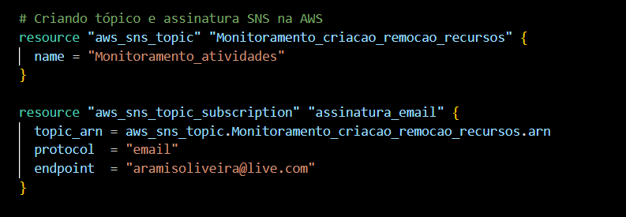
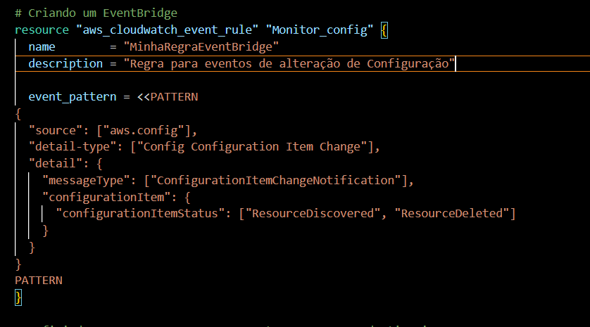
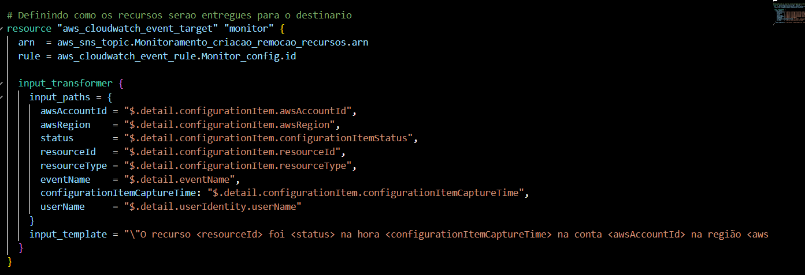
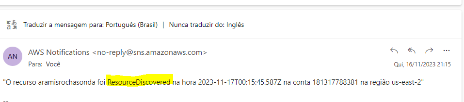
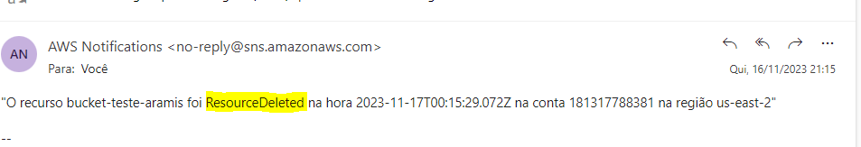

# Monitorar_Recursos_Config_Eventbridge
Monitoramento de Recursos e Alterações de Configuração com AWS EventBridge

Neste laboratório, vou apresentar uma abordagem para monitorar a criação e remoção de recursos em uma conta AWS. Para realizar este laboratório, é necessário ter o AWS Config habilitado e o barramento padrão ou um barramento criado.

Configuração Inicial

Primeiramente sera necessario criar um Topico com umas assinatura de email. Ao adicionar a assinatura é necessario validar a subscrição

Configuração da Regra no EventBridge

Em seguida, precisamos criar uma regra no EventBridge, definindo o AWS Config como fonte de informação. Na regra, estabelecemos que a regra é acionada apenas quando é identificada uma alteração de status, especificamente nas situações de "ResourceDiscovered" e "ResourceDeleted", que correspondem à criação e remoção de recursos.

ResourceDiscovered: Criação de recursos
ResourceDeleted: Remoção de recursos

Definição de Variáveis e Template

No bloco abaixo, declaramos os valores necessários para gerar o template com os dados que consideramos importantes. O template e as variáveis podem ser definidos de acordo com a necessidade..

Notificações de Criação e Remoção de Recursos
Por fim, a evidência da notificação da criação e remoção de recursos. Utilizei um bucket S3 para exemplificar.

